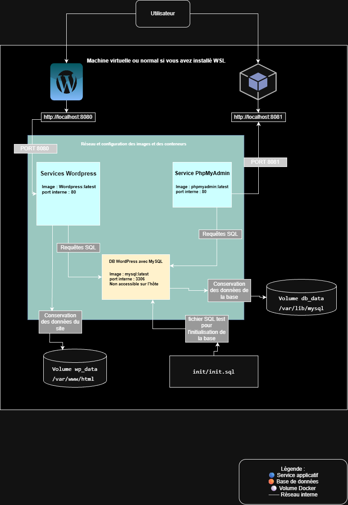
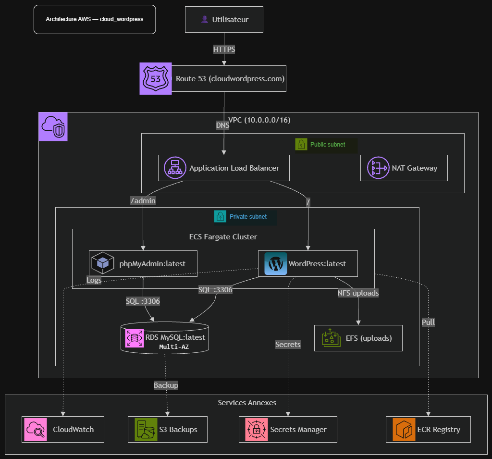

# 🌐 Projet Cloud Computing — WordPress + MySQL conteneurisé

**Module** : Cloud Computing — Licence 2  
**Modalité** : Travail en binôme  
**Scénario** : A — Application Open-Source (WordPress + MySQL + phpMyAdmin)  
**Dépôt Git** : [Lien du dépôt](https://github.com/dkaizen12/projet_cloud_wordpress)

---

## 👥 Membres du binôme

- **Dady KALANGOSO KANGELA** — `dady.kalangosokangela@epfedu.fr`
- **Marie-hanielle DEUTCHEU** — `marie-hannielle.deutcheuyonga@epfedu.fr`

---

## 📋 Description du scénario choisi (Scénario A)

Nous avons déployé **la version la plus récente de WordPress** (CMS open-source écrit en PHP) couplé à une base de données **MySQL (LTS)**, dans un environnement entièrement conteneurisé avec **Docker** et orchestré par **Docker Compose**.

Un troisième service, **phpMyAdmin (LTS)**, a été ajouté pour permettre l'administration visuelle de la base de données (bonus).

L'architecture repose sur **trois conteneurs** communiquant sur un **réseau interne dédié** :

| Service         | Image               | Rôle               | Port hôte     |
| --------------- | ------------------- | ------------------ | ------------- |
| `wordpress_app` | `wordpress:latest`  | CMS WordPress      | `8080`        |
| `wordpress_db`  | `mysql:latest`      | Base de données    | ❌ non exposé |
| `wordpress_pma` | `phpmyadmin:latest` | Administration BDD | `8081`        |

> Le choix des images en `latest` est motivé par le fait d'éviter le problème de compatibilité entre services et de prendre les versions les plus maintenables et prenant en charge le plus d'extension et de fonctionnalités possibles.

---

## 🏗️ Architecture Docker locale

### Vue d'ensemble

L'architecture locale repose sur trois conteneurs interconnectés via un réseau bridge dédié `wp_network` :



### Choix d'architecture locale

| Élément                | Choix retenu                    | Justification                                                              |
| ---------------------- | ------------------------------- | -------------------------------------------------------------------------- |
| **Réseau**             | `wp_network` (bridge explicite) | Isolation des conteneurs et communication par nom de service               |
| **Service WordPress**  | `wordpress:latest`              | version la plus récente pouvant être récupérée pouvant être trouvé         |
| **Service MySQL**      | `mysql:latest`                  | Version LTS, compatible WordPress                                          |
| **Service phpMyAdmin** | `phpmyadmin:latest`             | Bonus : interface d'administration pour accéder à la base de données, etc. |
| **Volumes**            | `db_data` + `wp_data`           | Persistance des données et fichiers même après suppression des stacks      |
| **Initialisation**     | `init/init.sql` monté en `:ro`  | Configuration automatique au 1er démarrage                                 |
| **Healthcheck**        | Sur MySQL uniquement            | WordPress ne démarre qu'une fois la BDD prête                              |
| **Ports exposés**      | `8080`, `8081`                  | La BDD (3306) reste interne                                                |

### Communication entre services

- **WordPress → MySQL** : requêtes SQL via le port interne `3306`
- **phpMyAdmin → MySQL** : requêtes SQL via le port interne `3306`
- **WordPress → `wp_data`** : persistance des fichiers constituant le site WordPress (thèmes, plugins, uploads)
- **MySQL → `db_data`** : persistance des données (articles, utilisateurs)
- **MySQL ← `init/init.sql`** : initialisation au premier démarrage

### Points clés de sécurité

- **Aucun port de la base de données** n'est exposé sur l'hôte
- **Seuls WordPress et phpMyAdmin** sont accessibles depuis l'extérieur
- **Les identifiants** proviennent du fichier `.env` (non versionné)
- un fichier exemple est versionné pour aider les utilisateurs à faire le leur.
- **Le script d'initialisation** est monté en lecture seule (`:ro`)

---

## ☁️ Architecture Cloud (AWS)

### Vue d'ensemble

En production, cette application serait déployée sur **AWS** avec des services managés :



### Choix d'architecture cloud

| Composant local | Composant AWS | Rôle | Explication |
|---|---|---|---|
| `wp_network` (bridge) | **VPC + Security Groups** | Isolation réseau | Le VPC reproduit le réseau `wp_network` en isolant les ressources dans un périmètre privé. Les Security Groups jouent le rôle de pare-feu en filtrant le trafic entrant/sortant, comme les règles implicites de Docker Compose mais en plus granulaire. |
| `wordpress_app` | **ECS Fargate** | Hébergement serverless | Fargate exécute le conteneur WordPress sans qu'on ait à gérer de serveur EC2. On obtient la même portabilité que Docker Compose, mais avec une mise à l'échelle automatique et une facturation à la seconde. |
| `wordpress_pma` | **ECS Fargate** | Tâche séparée | phpMyAdmin est isolé dans sa propre tâche pour respecter le principe de séparation des responsabilités. En cas de compromission de l'interface d'admin, WordPress n'est pas affecté. |
| `wordpress_db` | **RDS MySQL 8.0 (Multi-AZ)** | BDD managée haute dispo | RDS remplace le conteneur MySQL en déléguant les sauvegardes, les mises à jour de sécurité et la réplication à AWS. Le mode Multi-AZ garantit une bascule automatique en cas de panne d'une zone de disponibilité. |
| Volume `wp_data` | **EFS** | Fichiers partagés (uploads) | EFS est un système de fichiers réseau (NFS) qui peut être monté simultanément par plusieurs tâches ECS. Indispensable si WordPress est répliqué sur plusieurs instances, car chaque conteneur doit voir les mêmes uploads. |
| Volume `db_data` | (géré par RDS) | Persistance automatique | RDS stocke les données sur des volumes EBS répliqués, avec des snapshots automatiques. On n'a plus à gérer le volume `db_data` : AWS s'en charge. |
| `.env` | **Secrets Manager** | Gestion sécurisée des secrets | Secrets Manager chiffre les mots de passe, permet leur rotation automatique et les injecte dans les conteneurs au démarrage. C'est l'équivalent cloud du fichier `.env`, mais avec audit et chiffrement. |
| `localhost:8080` | **Route 53 + ALB** | Accès public DNS + charge | Route 53 résout `cloudwordpress.com` vers l'ALB. L'ALB répartit le trafic entre les tâches ECS, gère les certificats SSL (ACM) et effectue des health checks. En local, on accède directement au port 8080. |
| `docker compose logs` | **CloudWatch** | Logs et monitoring | CloudWatch centralise les logs de tous les services (ECS, RDS, ALB) et permet de créer des alarmes. Remplace `docker compose logs -f` par une interface web avec recherche et rétention. |
| Docker Hub | **ECR** | Registre privé d'images | ECR stocke les images Docker privées. ECS Fargate les pull au démarrage des tâches. Contrairement à Docker Hub, ECR s'intègre nativement à IAM pour le contrôle d'accès. |
| — | **S3** | Sauvegardes long terme | S3 stocke les snapshots RDS exportés et les backups WordPress. C'est un stockage objet durable (99,999999999 %) et peu coûteux, adapté à l'archivage. |
| — | **NAT Gateway** | Sortie Internet sécurisée | Permet aux tâches ECS et à RDS (dans les sous-réseaux privés) de télécharger des mises à jour ou d'envoyer des logs, sans être exposés à Internet. |
| — | **IAM** | Gestion des identités | Contrôle quels services peuvent accéder à quoi (ex : ECS peut lire Secrets Manager et ECR, mais pas S3). Remplace la gestion implicite des permissions Docker. |

### Flux de communication dans le cloud

```
┌──────────────┐
│ Utilisateur  │
└──────┬───────┘
       │ HTTPS (443)
       ▼
┌──────────────────┐
│ Route 53         │ ← Résolution DNS : cloudwordpress.com → ALB
│ (DNS managé)     │
└──────┬───────────┘
       │
       ▼
┌──────────────────────────┐
│ Application Load Balancer│ ← Répartition de charge + terminaison SSL
│ (Public Subnet)          │
└──────┬───────────────────┘
       │
       ├──────────────┬──────────┐
       │ /            │ /admin   │
       ▼              ▼          │
┌─────────────┐ ┌──────────────┐ │
│ ECS Fargate │ │ ECS Fargatecc│ │
│ WordPress   │ │ phpMyAdmin   │ │
│ (Private)   │ │ (Private)    │ │
└──────┬──────┘ └──────┬───────┘ │
       │               │         │
       │ SQL 3306      │SQL 3306 │
       ▼               ▼         │
┌──────────────────────────────┐ │
│ RDS MySQL 8.0 (Multi-AZ)     │ │
│ Primary + Standby            │ │
│ (Private Subnet)             │ │
└──────────────┬───────────────┘ │
               │ Backup          │
               ▼                 │
          ┌─────────────┐        │
          │ S3          │        │
          │ (backups)   │        │
          └─────────────┘        │
                                 │
Services transverses :           │
┌──────────────┐ ┌────────────┐  │
│ ECR (images) │ │ Secrets Mgr│◄─┘
└──────────────┘ └────────────┘
┌──────────────┐ ┌────────────┐
│ EFS (files)  │ │ CloudWatch │
└──────────────┘ └────────────┘
```

### Description des flux

| # | Flux | Protocole | Description |
|---|---|---|---|
| 1 | Utilisateur → Route 53 | DNS | Résolution du nom de domaine `cloudwordpress.com` |
| 2 | Route 53 → ALB | A (alias) | Le DNS pointe vers l'ALB |
| 3 | ALB → ECS WordPress | HTTP/HTTPS | Route `/` vers la tâche WordPress |
| 4 | ALB → ECS phpMyAdmin | HTTP/HTTPS | Route `/admin` vers la tâche phpMyAdmin |
| 5 | WordPress → RDS | TCP 3306 | Requêtes SQL pour lire/écrire les articles |
| 6 | phpMyAdmin → RDS | TCP 3306 | Requêtes SQL d'administration |
| 7 | WordPress → EFS | NFS | Lecture/écriture des uploads et plugins |
| 8 | ECS → ECR | HTTPS | Pull des images Docker au démarrage |
| 9 | ECS → Secrets Manager | HTTPS | Récupération des mots de passe |
| 10 | RDS → S3 | HTTPS | Export des snapshots pour archivage |
| 11 | ECS/RDS/ALB → CloudWatch | HTTPS | Envoi des logs et métriques |
| 12 | ECS → NAT Gateway | HTTPS | Accès Internet sortant pour mises à jour |

### Bonnes pratiques cloud

1. **Isolation réseau** : conteneurs et BDD dans des sous-réseaux privés
2. **Haute disponibilité** : RDS Multi-AZ, plusieurs tâches ECS derrière l'ALB
3. **Serverless** : pas de serveur EC2 à gérer (ECS Fargate)
4. **Sécurité** : Secrets Manager au lieu de fichiers `.env` en clair
5. **Observabilité** : CloudWatch pour logs et métriques
6. **Sauvegardes** : S3 pour l'archivage long terme

---

## 🚀 Installation et lancement

> ✅ **Toutes les commandes ci-dessous ont été testées et fonctionnent du premier coup.**  

### 📦 Prérequis

Avant de commencer, assurez-vous d'avoir :

| Outil              | Version minimale | Vérification             |
| ------------------ | ---------------- | ------------------------ |
| **Docker Engine**  | ≥ 20.10          | `docker --version`       |
| **Docker Compose** | ≥ 2.x            | `docker compose version` |
| **Git**            | ≥ 2.30           | `git --version`          |

> 💡 **Windows** : utilisez **WSL2** avec Ubuntu 24.04 ou docker desktop.  
> 💡 **Linux/macOS** : Docker Desktop ou Docker Engine natif.

### 📥 Étape 1 — Cloner le dépôt

```bash
git clone https://github.com/<votre-username>/projet_cloud_wordpress.git
cd projet_cloud_wordpress
```

### 🔐 Étape 2 — Créer le fichier `.env`

Le fichier `.env` contient les secrets (mots de passe). Un modèle est fourni.

```bash
cp .env.example .env
```

Le contenu par défaut du `.env` est **fonctionnel immédiatement** :

```env
MYSQL_ROOT_PASSWORD=R00t@Cloud2024!Sec
MYSQL_DATABASE=wordpress_db
MYSQL_USER=wp_admin_cloud
MYSQL_PASSWORD=Wp@Cloud2024!Sec
WORDPRESS_PORT=8080
PMA_PORT=8081
```

> 💡 **Aucune modification n'est requise** pour lancer le projet.  
> Si vous souhaitez changer les mots de passe, éditez ce fichier **avant** l'étape 3.

### 🚀 Étape 3 — Lancer la stack

```bash
docker compose up -d
```

Cette commande va :

1. Télécharger les images `mysql`, `wordpress`, `phpmyadmin`
2. Créer les 3 conteneurs
3. Créer les volumes `db_data` et `wp_data`
4. Créer le réseau `wp_network`
5. Exécuter `init/init.sql` au premier démarrage

### ✅ Étape 4 — Vérifier que tout tourne

```bash
docker compose ps
```

Vous devez voir **3 conteneurs** en état `Up` (et `healthy` pour `wordpress_db`) :

```
NAME              IMAGE                              STATUS
wordpress_app     wordpress:7.1-php8.2-apache        Up
wordpress_db      mysql:8.0                          Up (healthy)
wordpress_pma     phpmyadmin:5.2-apache              Up
```

> ⏱️ **Patientez 20 à 30 secondes** que MySQL soit complètement prêt (`healthy`).

### 🌐 Étape 5 — Accéder aux services

| Service        | URL                   | Identifiants                          |
| -------------- | --------------------- | ------------------------------------- |
| **WordPress**  | http://localhost:8080 | À créer lors de l'installation        |
| **phpMyAdmin** | http://localhost:8081 | `wp_admin_cloud` / `Wp@Cloud2024!Sec` |

**Première visite WordPress** : suivez l'assistant d'installation (langue, titre du site, compte admin).
**phpMyAdmin** : saisissez les identifiants manuellement à l'écran de connexion.

---

## 🔍 Vérifications post-lancement

### Vérifier l'initialisation de la base

```bash
docker exec -it wordpress_db mysql -u wp_admin_cloud -p -e "USE wordpress_db; SELECT * FROM init_test;"
```

Saisissez `Wp@Cloud2024!Sec` quand demandé. Vous devez voir **2 lignes** :

```
+----+----------------------------------------------+---------------------+
| id | message                                      | created_at          |
+----+----------------------------------------------+---------------------+
|  1 | Base initialisée avec succès par init.sql    | 2024-XX-XX XX:XX:XX |
|  2 | Projet Cloud Computing - Licence 2           | 2024-XX-XX XX:XX:XX |
+----+----------------------------------------------+---------------------+
```

### Vérifier la sécurité réseau

```bash
docker port wordpress_db
```

**Résultat attendu** : aucune ligne affichée (le port 3306 n'est pas exposé). ✅

### Vérifier les volumes

```bash
docker volume ls | grep cloud_wordpress
```

**Résultat attendu** :

```
local     cloud_wordpress_db_data
local     cloud_wordpress_wp_data
```

---

## 🛑 Arrêter la stack

```bash
# Arrêt simple (conserve les données)
docker compose down
# Arrêt avec suppression des volumes (⚠️ détruit les données)
docker compose down -v
```

---

## 💾 Persistance des données

Deux **volumes Docker nommés** garantissent que les données survivent aux redémarrages :

| Volume    | Chemin dans le conteneur | Contenu                                       |
| --------- | ------------------------ | --------------------------------------------- |
| `db_data` | `/var/lib/mysql`         | Base de données MySQL                         |
| `wp_data` | `/var/www/html`          | Fichiers WordPress (thèmes, plugins, uploads) |

### Pourquoi ces volumes ?

Sans volumes Docker, **toutes les données seraient perdues** à chaque `docker compose down`, car les conteneurs sont éphémères. Les volumes permettent de **découpler le cycle de vie des données** de celui des conteneurs.

### Test de persistance effectué

| Étape | Action                                                     | Résultat                                                                |
| ----- | ---------------------------------------------------------- | ----------------------------------------------------------------------- |
| 1     | Création d'un article WordPress + vérification `init_test` | ✅ Données présentes                                                    |
| 2     | `docker compose down` (sans `-v`)                          | Volumes conservés                                                       |
| 3     | `docker compose up -d`                                     | ✅ Article et données toujours présents                                 |
| 4     | `docker compose down -v`                                   | Volumes détruits                                                        |
| 5     | `docker compose up -d`                                     | WordPress réinstallé, prouvant que les données étaient dans les volumes |

---

## 🛠️ Commandes utilisées pour la création et le développement

Cette section retrace toutes les commandes exécutées pour construire le projet.

### 1. Installation de l'environnement

#### 1.1 Activation de WSL2 et installation d'Ubuntu

```bash
# Dans PowerShell (administrateur)
wsl --install
wsl --install -d Ubuntu-24.04
wsl --set-default Ubuntu-24.04
wsl -l -v
```

#### 1.2 Installation de Docker sur Ubuntu (WSL) s'il était pas déjà installé

```bash
sudo apt update && sudo apt upgrade -y
sudo apt install -y ca-certificates curl gnupg lsb-release git

sudo install -m 0755 -d /etc/apt/keyrings

curl -fsSL https://download.docker.com/linux/ubuntu/gpg | sudo gpg --dearmor -o /etc/apt/keyrings/docker.gpg

sudo chmod a+r /etc/apt/keyrings/docker.gpg


echo "deb [arch=$(dpkg --print-architecture) signed-by=/etc/apt/keyrings/docker.gpg] https://download.docker.com/linux/ubuntu $(lsb_release -cs) stable" | sudo tee /etc/apt/sources.list.d/docker.list > /dev/null

sudo apt update

sudo apt install -y docker-ce docker-ce-cli containerd.io docker-buildx-plugin docker-compose-plugin

sudo usermod -aG docker $USER
newgrp docker

docker --version
docker compose version

docker run hello-world
```

> Si vous aviez installé docker desktop récemment, vous n'aurez qu'à aller sur l'application dans les paramètres puis dans ressources puis dans `WSL integration` , cochez `Enable integration with my default WSL distro` puis sélectionnez votre distribution installer, ensuite verifiez sur le terminal WSL si cela fonctionne.

### 2. Création de la structure du projet

```bash
mkdir -p ~/projets/cloud_wordpress
cd ~/projets/cloud_wordpress

mkdir -p init

touch docker-compose.yml .env .env.example .gitignore README.md
```

### 3. Configuration des fichiers

```bash
nano .env              # Secrets MySQL et ports
nano .env.example      # Modèle du .env

nano docker-compose.yml
nano init/init.sql
nano .gitignore
```

### 4. Lancement et vérifications

```bash
docker compose up -d
docker compose ps
docker compose logs -f

docker exec -it wordpress_db mysql -u wp_admin_cloud -p -e "USE wordpress_db; SELECT * FROM init_test;"

docker volume ls | grep cloud_wordpress
docker port wordpress_db
```

### 5. Test de persistance

```bash
docker compose down
docker volume ls | grep cloud_wordpress
docker compose up -d
docker compose down -v
```

### 6. Initialisation Git

```bash
git config --global user.name "Votre Nom"
git config --global user.email "votre.email@exemple.com"
git config --global init.defaultBranch main

ssh-keygen -t ed25519 -C "votre.email@exemple.com"
cat ~/.ssh/id_ed25519.pub
ssh -T git@github.com

git init
git add .
git commit -m "Initial commit: structure du projet WordPress + MySQL"

git remote add origin git@github.com:<votre-username>/cloud_wordpress.git
git push -u origin main
```

### 7. Commandes de maintenance

| Commande                             | Rôle                        |
| ------------------------------------ | --------------------------- |
| `docker compose up -d`               | Lancer la stack             |
| `docker compose ps`                  | État des conteneurs         |
| `docker compose logs -f`             | Suivre les logs             |
| `docker compose down`                | Arrêter (conserve volumes)  |
| `docker compose down -v`             | Arrêter + supprimer volumes |
| `docker compose exec wordpress bash` | Shell dans un conteneur     |
| `docker volume ls`                   | Lister les volumes          |
| `docker network ls`                  | Lister les réseaux          |
| `docker stats`                       | Utilisation des ressources  |

---

## 🔒 Bonnes pratiques implémentées

1. **Externalisation des secrets** : mots de passe dans `.env` **non versionné** (ajouté au `.gitignore`). Un `.env.example` sert de modèle.
2. **Base de données non exposée** : le port `3306` n'est **pas** mappé sur l'hôte. Seuls les conteneurs du réseau `wp_network` y accèdent.
3. **Réseau interne explicite** : réseau bridge `wp_network` déclaré pour l'isolation et la communication par nom de service.
4. **Healthcheck sur MySQL** : WordPress ne démarre qu'une fois MySQL prêt (`condition: service_healthy`).
5. **Initialisation automatique** : `init/init.sql` monté en lecture seule (`:ro`) dans `/docker-entrypoint-initdb.d/`.
6. **Redémarrage contrôlé** : `restart: unless-stopped` assure la résilience.
7. **Séparation des responsabilités** : un service = une fonction (CMS, BDD, administration).

---

## 📂 Structure du projet

```
cloud_wordpress/
├── docker-compose.yml          # Orchestration des 3 services
├── .env                        # Secrets (non versionné)
├── .env.example                # Modèle du .env (versionné)
├── .gitignore                  # Exclusion de .env et fichiers temporaires
├── README.md                   # Ce fichier
├── architecture_docker.png     # Schéma d'architecture locale (Docker)
├── architecture_cloud.png        # Schéma d'architecture cloud (AWS)
└── init/
    └── init.sql                # Script d'initialisation MySQL
```

---

## 🧪 Dépannage (troubleshooting)

| Problème                       | Solution                                             |
| ------------------------------ | ---------------------------------------------------- |
| `port 8080 already in use`     | Modifier `WORDPRESS_PORT` dans `.env`                |
| `port 8081 already in use`     | Modifier `PMA_PORT` dans `.env`                      |
| MySQL reste `unhealthy`        | Attendre 30 s ou consulter `docker compose logs db`  |
| WordPress ne se connecte pas   | Vérifier `docker compose ps` et les variables `.env` |
| `permission denied` sur Docker | `sudo usermod -aG docker $USER && newgrp docker`     |
| Volumes à réinitialiser        | `docker compose down -v && docker compose up -d`     |
| Pour toutes autres questions   | Me contacter par le mail mentionnez ci-haut          |

---

## 📜 Licence

Projet académique — Module Cloud Computing, Licence 2.  
Aucune licence commerciale. Usage pédagogique uniquement.

---

## 📚 Annexes

- [Documentation Docker Compose](https://docs.docker.com/compose/)
- [Documentation WordPress](https://wordpress.org/documentation/)
- [Documentation MySQL 8.0](https://dev.mysql.com/doc/refman/8.0/en/)
- [Documentation AWS ECS](https://docs.aws.amazon.com/ecs/)
- [Documentation AWS RDS](https://docs.aws.amazon.com/rds/)
